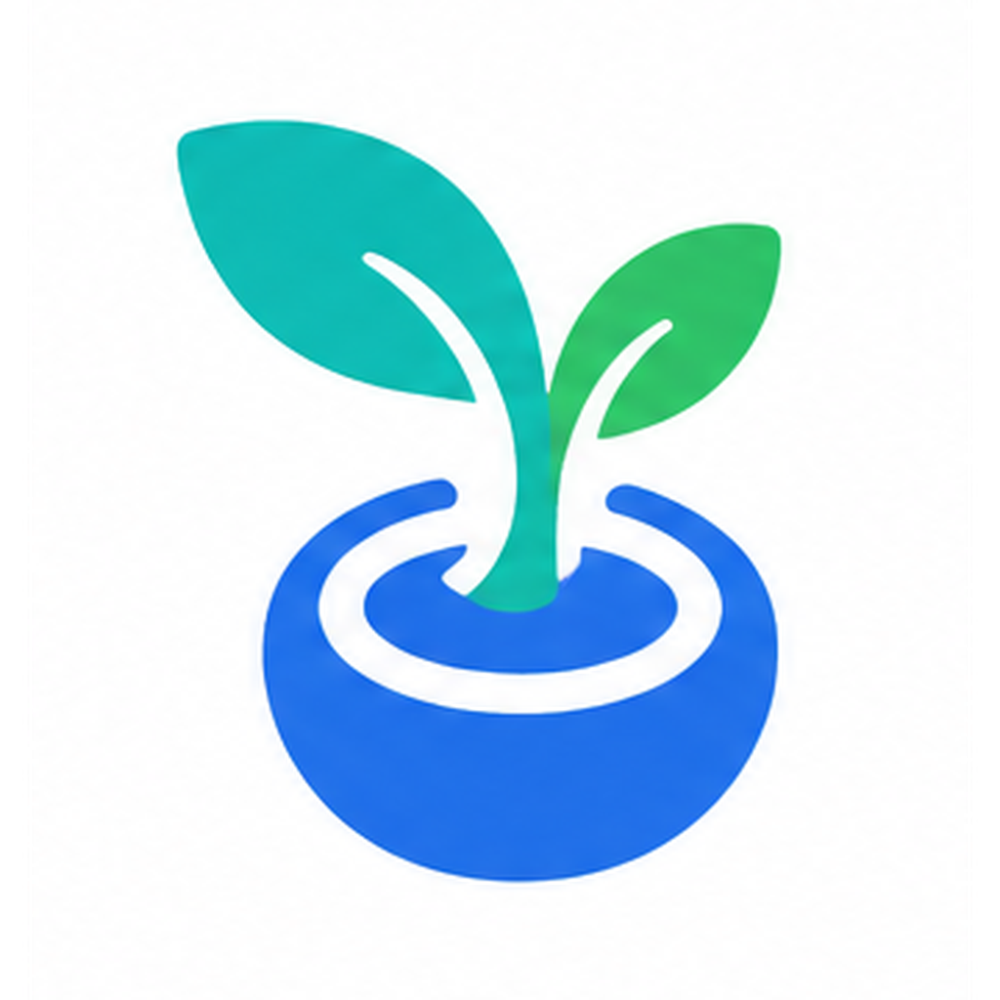

# Buku Panduan Pengguna
## Aplikasi Pencatatan Keuangan & Manajemen Gaya Hidup

Selamat datang di Buku Panduan Pengguna! Aplikasi ini dirancang tidak hanya untuk mencatat keuangan Anda, tetapi juga membantu Anda memantau kebiasaan dan kalori harian untuk gaya hidup yang lebih baik.

---

### Daftar Isi
1. [Pendahuluan](#pendahuluan)
2. [Memulai Aplikasi](#memulai-aplikasi)
3. [Fitur Utama](#fitur-utama)
   - [Dashboard Keuangan](#dashboard-keuangan)
   - [Manajemen Transaksi & Pengeluaran](#manajemen-transaksi--pengeluaran)
   - [Pelacak Kebiasaan (Habit Tracker)](#pelacak-kebiasaan)
   - [Pelacak Kalori (Calorie Tracker)](#pelacak-kalori)
   - [Perencanaan (Plan) & Progress](#perencanaan--progress)
4. [Pengaturan](#pengaturan)

---

### Pendahuluan
Aplikasi ini adalah solusi *all-in-one* untuk manajemen pribadi Anda. Dengan menggabungkan pencatatan keuangan, pelacakan kebiasaan, dan pemantauan kalori, Anda dapat melihat gambaran menyeluruh tentang kesejahteraan finansial dan fisik Anda di satu tempat.

### Memulai Aplikasi
1. **Login/Registrasi:** Saat membuka aplikasi, Anda akan diarahkan ke halaman Login. Masukkan kredensial Anda untuk masuk.

2. **Navigasi Utama:** Setelah masuk, Anda akan melihat menu navigasi yang memungkinkan Anda berpindah antara fitur Keuangan (Dashboard, Transaksi), Kebiasaan, Kalori, dan Pengaturan.

### Fitur Utama

#### Dashboard Keuangan
Dashboard adalah pusat informasi keuangan Anda.

- **Ringkasan Saldo:** Menampilkan total saldo saat ini.
- **Grafik Mingguan:** Pantau arus kas (Cash Flow) Anda secara visual melalui grafik.
- **Transaksi Terakhir:** Lihat daftar transaksi yang baru saja Anda lakukan dengan cepat.
- **Ringkasan Pengeluaran:** Memantau alokasi budget dan total pengeluaran Anda.

#### Manajemen Transaksi & Pengeluaran

- **Mencatat Transaksi:** Masuk ke menu `Transactions` untuk menambahkan pemasukan atau pengeluaran baru. Isi detail seperti jumlah, kategori, dan tanggal.
- **Anggaran (Budgeting):** Pada menu `Expenses`, Anda dapat mengatur batas anggaran (Budget) menggunakan fitur *Budget Modal* agar pengeluaran tetap terkendali.

#### Pelacak Kebiasaan (Habit Tracker)
Aplikasi ini memungkinkan Anda membangun kebiasaan baik.

- Masuk ke menu `Habit`.
- Tambahkan kebiasaan yang ingin Anda pantau setiap harinya.
- Tandai (checklist) kebiasaan yang sudah diselesaikan untuk menjaga *streak* Anda.

#### Pelacak Kalori (Calorie Tracker)
Jaga pola makan Anda dengan mencatat kalori.

- Masuk ke menu `Calorie`.
- Catat makanan atau minuman yang Anda konsumsi beserta jumlah kalorinya.
- Pantau apakah asupan kalori Anda sesuai dengan target harian.

#### Perencanaan & Progress

- **Plan:** Gunakan menu ini untuk merencanakan target jangka pendek maupun jangka panjang (seperti target tabungan atau target berat badan).
- **Progress:** Pantau seberapa jauh Anda sudah mencapai target-target tersebut.

### Pengaturan

Pada menu `Settings`, Anda dapat:
- Mengubah profil dan preferensi akun Anda.
- Mengatur preferensi aplikasi (tema, notifikasi, dll).
- Mengelola data Anda (ekspor/hapus data).

---
*Panduan ini dibuat untuk membantu Anda memaksimalkan fitur dalam aplikasi. Selamat menggunakan!*
